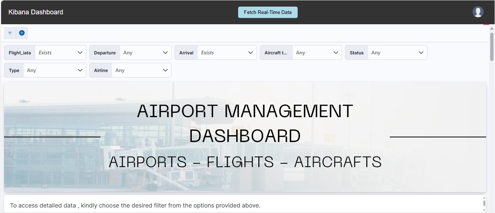
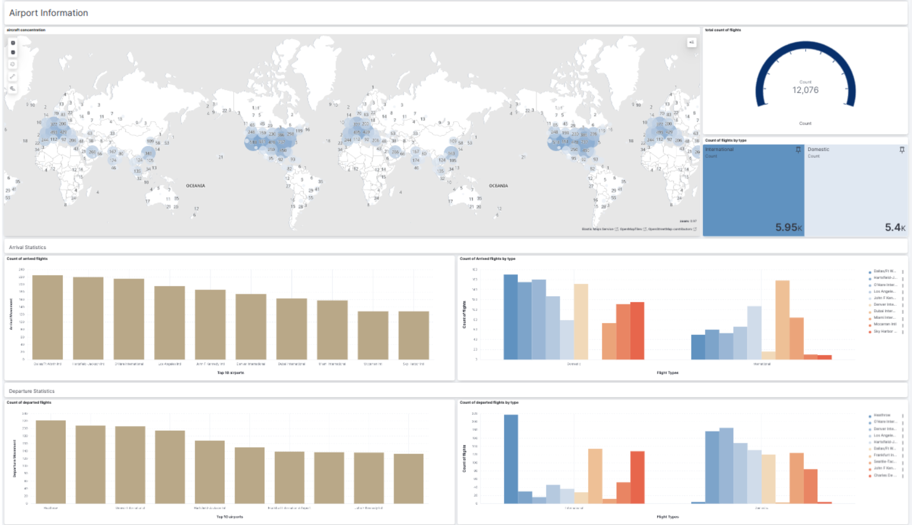
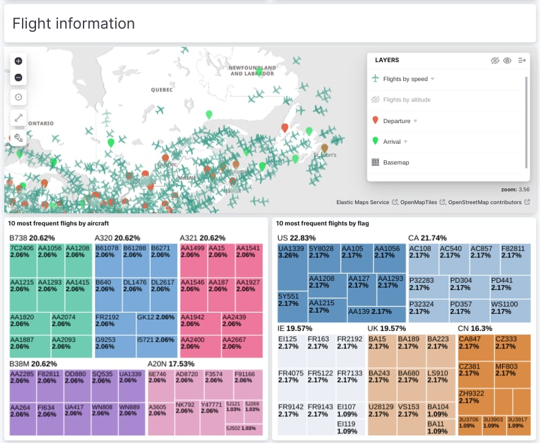
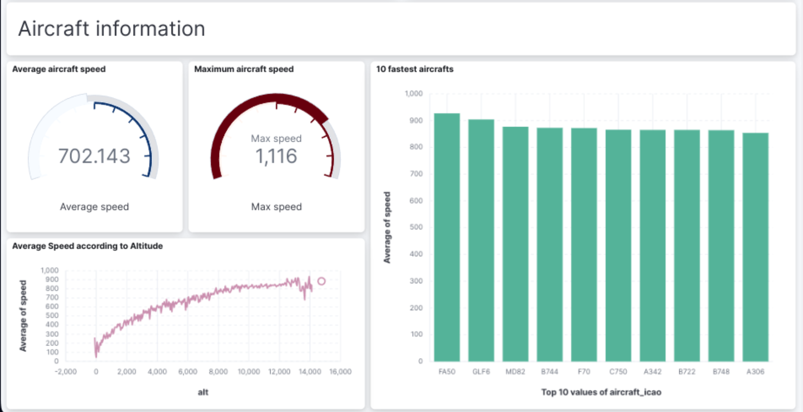

#  **Real-Time Flight Data Visualization Dashboard** 

## 📖 **Table of Contents**
- [📌 Project Overview](#-project-overview)
- [🔑 Key Objectives](#-key-objectives)
- [🛠️ Technologies Used](#-technologies-used)
- [🏛️ Architecture](#-architecture)
- [🐳 Dockerized Environment](#-dockerized-environment)
- [🔧 Setup and usage](#-setup-and-usage)
- [⚙️ Services](#-services)
- [🖥️ Results](#-results)
- [🔮 Future Considerations](#-future-considerations)
- [👨‍💻 Project By](#-project-by)


## 📌 Project Overview  

This project, developed by Hiba Daoud and Saad Raza as part of their academic journey at the University of Trento, delivers a **Real-Time Flight Data Visualization Dashboard** offering an interactive platform to monitor live flight data, airport details, and aircraft statistics.

### **Project Requirements**

- **Layered Architecture Implementation**:
    - Data Layer    
    - Adapter Layer  
    - Business Logic Layer   
    - Process-Centric Layer
    - Visualization Layer
    - Authentication System

- **General Design Principles:**
    - **Modular** and **Scalable** services designed for reusability and easy scaling across different environments.  
    -  Services interact exclusively through **REST APIs** for standardized communication.  
    - **Internal and External Integration**: Incorporates external flight data API and internal data processing and visualization components.  

- **Defined Data Structures**:
   - Inputs and outputs for services are JSON-based, with clear schema definitions provided for external and internal data exchanges.

- **Use of a Database Management System**

- **Deployment**
    - Entire system is containerized using **Docker** for consistency, scalability, and portability.
    - Deployment ensures real-time data processing and visualization with seamless user interaction.


## 🗝️ Key Features

### ✈️ Real-Time Flight Data Processing
- **Kafka Integration:** A Kafka producer-consumer system is used for streaming real-time flight data from an **external API: Airlabs Data API** 
- **PySpark Consumer:** Consumes flight data from Kafka in real-time, processes and transforms the data for meaningful insights.
- **Elasticsearch Integration:** Stores processed data in Elasticsearch for fast querying and retrieval of flight data.

### 📊 Interactive Data Visualization
- **Kibana Dashboard:** Displays real-time flight data, airports details, and aircafts statistics.

### 🌐 Interactive Web Application 
- **User Authentication:** Secure login and registration system with **token authorization**. User-related data are stored in **MongoDB**
- **Dynamic Dashboard:** Embedded Kibana dashboard using an iframe for real-time data visualization.

### 🏗️ Microservices Architecture 
- **Process-Centric API:** Coordinates user-triggered actions, such as data fetching.
- **RESTful APIs:** Enables interaction between services through clearly defined endpoints.
- **Reusable and Scalable:** Each service is modular and can be extended for other use cases.

### 🐳 Containerized Deployment
- **Dockerized Services:** All services are containerized for portability and scalability.
- **Container Orchestration:** Docker Compose manages service dependencies and networking.

## 🛠️ **Technologies Used**

| **Technology**        | **Purpose**                                                                 |
|-----------------------|-----------------------------------------------------------------------------|
| Kafka                 | Acts as a message broker for real-time data streaming.                     |
| PySpark               | Processes, transforms, and enriches real-time flight data.                 |
| Elasticsearch         | Indexes processed data for visualization in Kibana.                        |
| Kibana                | Provides real-time data visualization on a Dashboard.              |
| Node.js (Express)     | Handles user authentication and user-triggered actions.           |
| MongoDB               | Stores user credentials.                               |
| HTML, CSS, JS         | Builds the web interface.                                                   |
| Docker                | Manages services in isolated and consistent environments.                  |

## 🏛️ Architecture

The web application incorporates **JWT-based authentication** for secure user authorization, with user credentials securely stored in **MongoDB**. Upon successful login, a **Kibana dashboard** is displayed, presenting **real-time flight data** retrieved from the **Airlabs API**, which offers extensive information on air traffic and airport density.

The data flow begins with a **Kafka producer**, which transmits the flight data to a topic named `flight`. For data processing, **Apache Spark** subscribes to the `flight` topic, retrieves the data, processes it, and sends the results to **Elasticsearch**, where it is stored in the `esflight` index. 

The **Kibana dashboard** is used to visualize the processed data in real time with precision. This dashboard is seamlessly embedded within the web application, providing users with a unified and interactive experience.

#### **1. Data Layer**  
Manages and stores persistent data:
- **MongoDB**: Handles user authentication data (email, password, tokens).  
- **Elasticsearch**: Stores and queries processed real-time flight data visualized in Kibana.

#### **2. Adapter Layer**  
Connects external API with internal systems:
- **Kafka**: Ingests and distributes real-time flight data.  
- **Python Requests**: Fetches data from **Airlabs Data APIs** and sends it to Kafka for processing.

#### **3. Business Logic Layer**  
Manages core functionality and processing:
- **Pyspark**: Processes real-time flight data from Kafka, transforms it and indexes it into Elasticsearch.  
- **Node.js (Express)**: Implements backend logic, including user authentication.

#### **4. Process-Centric Layer**  
Coordinates user actions and system workflows:
- **Node.js (Express)**: Provides REST APIs for login, registration, fetching real-time data, and triggering producer actions.

## 🐳 Dockerized Environment
To ensure seamless operation and management, our project is built upon a Dockerized environment, encapsulating each component of the system within its own container. This approach not only fosters a modular architecture, making it easier to update and maintain individual parts without affecting the whole system, but also enhances scalability and fault tolerance. 

Each service, from Kafka for real-time data ingestion to Kibana for insightful visualizations, operates in an isolated yet interconnected manner through a custom Docker network.

## 🔧 Setup and Usage
- In order to see the web application with Real Time visualization Dashboard you just need to run the  `docker-compose.yml`:
    ```bash
        docker-compose up -d
    ```
- Access the web application via `http://localhost:8080`.
- The landing page provides navigation options to login or register.
- Upon successful login, the Kibana dashboard is displayed with Real Time data
- The button Fetch Real Time Data is used for retrieving new data when needed.

> [!NOTE]
> Note that this is only for seeing results directly but we will detail every service and its usage in the next section.

## ⚙️ Services
### Kakfa service: 
- Kafka is used as a message broker, enabling real-time data streaming. It fetches data from Airlabs API using `api_key` and distributes it for processing and visualization.
- **Services in `docker-compose.yml`**
    - **Zookeeper**: `docker.io/bitnami/zookeeper:3.8`
        - Coordinates and manages Kafka brokers.
        - Required for Kafka to function properly.
    - **Kafka**: `docker.io/bitnami/kafka:3.3`
        - Streams real-time data using topics.
        - Acts as the backbone for data ingestion and distribution.
- **Producer:** Publishes flight data fetched from the Airlabs API into a Kafka topic (flights).
    - `Producer({'bootstrap.servers': 'kafka:9093'})`: Connects the producer to Kafka inside the Docker network to publish messages to a topic. Used in `producer_app.py` because the producer is launched from the backend service, triggered by a user action. This communicates with Kafka internally within the Docker network.
    - `Producer({'bootstrap.servers': 'localhost:9092'})`: Connects the producer to Kafka outside Docker via the host's port to publish messages. Used in `producer.py` to manually test and launch the producer independently. This setup allows testing Kafka locally and running the consumer locally to observe the output of the Kafka service independently.
- **Consumer:** Subscribes to the flights topic, retrieves data, and stores it in `fetched_data.json`
    ```
        consumer = Consumer({
        'bootstrap.servers': 'localhost:9093' ,
        'group.id': 'my-group',                
        'auto.offset.reset': 'earliest'      
        })
    ```
- **Steps to Launch Kafka and retrieves data Locally**
    - Start `docker-compose.yml`:
        ```
        docker-compose up -d
        ```
    - Install Python Dependencies: In the Kafka directory, install the required Python packages:

        ```
        pip install requests confluent_kafka python-dotenv
        ```
    - In the Kafka directory, create a `.env` file with the following content:
        ```
        api_url="https://airlabs.co/api/v9/flights?api_key=<your-key>"
        ```
    - Start the Producer
        ```
        python kafka/producer.py
        ```
    - **In another terminal**, start the Consumer
        ```
        python kafka/consumer.py
        ```
        This will generate a `fetched_data.json` file containing the retrieved and processed data.

### Spark Service: 
The Spark service processes real-time flight data retrieved from the Kafka topic, enriches it with additional information (e.g., airport names, flight types), and stores it in Elasticsearch for visualization in Kibana.

- **Services in `docker-compose.yml`**
    - **spark-master** : `hiba25/flight-dash:spark-master`
        - Custom image built from `spark/Dockerfile` to install Python dependencies, Scala, and configure Spark with specific scripts.
        - Acts as the master node of the Spark cluster.  
    - **spark-worker-1** : `hiba25/flight-dash:spark-worker-1`
        - Custom image built from `spark/Dockerfile`. Shares the same build as Spark Master for consistency.
        - Acts as a worker node to assist the master node in processing tasks.  
        - Connects to the Spark master at `spark://spark-master:7077`.

- **Steps Performed in `spark_stream.py`**
    - **Reading from Kafka:**
        - Subscribes to the Kafka topic `flights` using the broker `kafka:9092`.  
        - Consumes incoming messages in real-time.

    - **Data Enrichment:**
        - Enriches data with attributes like `type` which specify if the flight is domestic or international.  
        - Maps IATA codes (`dep_iata`, `arr_iata`) to airport details such as names and positions using `airports_external.csv` creating new fields: `Arrival`, `Departure`, `dep_pos`, `arr_pos`
        - Cleans and filters rows with missing data fields.

    - **Writing to Elasticsearch:**
        - Stores the enriched data in the Elasticsearch index `esflight`.  
        - Ensures unique records using `reg_number` as the identifier.

- **Steps to Launch Spark Locally**
    - Replace `SPARK_PUBLIC_DNS` with **your local ip** in `spark-env.sh`.
    - To see the Spark processing results independently in the console, comment out the Elasticsearch writing code and uncomment the `writeStream` section configured for console output.
    - Start `docker-compose.yml`:
        ```bash
        docker-compose up -d
        ```
    - The processed data will be printed in a table in the logs of the `spark-master` container.
        ```bash
        docker logs -f spark-master
        ```

### Elasticsearch Integration:   
Elasticsearch is responsible for storing and indexing the processed flight data to enable efficient querying and real-time visualization in Kibana. It depends on the Kafka service to retrieve processed data streams from the flights topic for indexing. This ensures persistent data storage, allowing historical data to remain accessible even when services are stopped or no new data is being ingested.
- **Elasticsearch image**: Custom image `hiba25/flight-dash:elasticsearch` built with the necessary Elasticsearch setup from `elasticsearch/Dockerfile'.
- `custom_startup.sh`: Automates Elasticsearch initialization, waits for readiness, and creates the `esflight` index using `create_index_elastic.py`
-   `create_index_elastic.py`: Defines and creates the esflight index with necessary mappings in Elasticsearch.
- **Steps to Launch Elasticsearch**
    - Start `docker-compose.yml`:
        ```bash
        docker-compose up -d
        ```
    - Use Elasticsearch HTTP API `localhost:9200` to query data directly or ensure data is flowing into the esflight index after Spark processing:
        ```bash
        curl -X GET "localhost:9200/esflight/_search?pretty"
        ```
    - To know how much data is stored in elasticsearch browse `http://localhost:9200/esflight/_count`
    
### **Kibana Service**

Kibana serves as the **real-time data visualization** layer in this project, connecting to Elasticsearch to fetch and display processed flight data. The data is displayed in custom dashboard with insightful graphs and maps. The dashboard is embedded into the web application using an `iframe`, providing users with an interactive and seamless visualization experience.
- **Kibana image**: Custom image `hiba25/flight-dash:kibana` built with the necessary Kiabana setup from `kibana/Dockerfile'.
- `custom_cmd.sh`:
   - Executes essential setup scripts and ensures Kibana runs smoothly.
   - Calls `load_ndjson.sh` to import the preconfigured dashboard into Kibana.
- `load_ndjson.sh`:
   - Imports saved the Kibana dashboard using the Kibana API.
   - Ensures the dashboard is available immediately after starting the Kibana container.
- `export.ndjson`:
   - Contains the exported configuration for Kibana dashboard, visualization, and saved objects.
   - Loaded into Kibana on startup to provide prebuilt visualizations.
- **Steps to Launch Kibana**
    - Start `docker-compose.yml`:
        ```bash
        docker-compose up -d
        ```
    - Browse Kibana HTTP API `localhost:5601` to visualize and interacte with data stored in Elasticsearch.
    - Go to Management > StackManagement > Kibana > Saved Objects
    - You will see Airport Managment Dashboard, click on it and vizualize the data with custom graphs
    - If not import `export.ndjson` manually.

###  Backend Service 
The backend service is the core API for user authentication, data handling, and Kafka producer triggering. It connects with other services, such as MongoDB for storing user credentials and Kafka for data streaming, and provides RESTful endpoints for user interactions.
- **Services Used**
    - **MongoDB** : `mongo:latest`
        - **Purpose**: Stores user authentication data (email, password, tokens).  
        - **Integration**: MongoDB is accessed via Mongoose in the `server.js` file for operations like user registration and login.
    - **Kafka**  
        - **Purpose**: Acts as the message broker for streaming flight data.  
        - **Integration**: Upon successful user login, the backend triggers the Kafka producer (`producer_app.py`) to fetch and publish real-time flight data.
    - **Node.js (Express)** `hiba25/flight-dash:backend`  
        - **Purpose**: Implements RESTful APIs for user authentication (`/register`, `/login`) and producer management (`/start-producer`).  
        - **Docker Image**: Custom image built from `backend/Dockerfile` to install Python and nodejs dependencies.
- `server.js`: Contains the API logic and middleware for authentication. It handles user authentication, token validation, and producer control.
    - **Login API**: Triggers the Kafka producer and returns a **JWT token** upon successful login.
    - **Protected API**: `/dashboard` uses JWT to allow access only to authenticated users.
- **Steps to Launch the Backend**
    - In the same directory as `docker-compose.yml`, create a `.env` file with the following content:
        ```
        MONGO_INITDB_ROOT_USERNAME=<mongo_username>
        MONGO_INITDB_ROOT_PASSWORD=<mongo_password>
        MONGO_INITDB_DATABASE=auth_db
        MONGO_URI=mongodb://mongo:27017/auth_db?authSource=admin
        API_URL = "https://airlabs.co/api/v9/flights?api_key=<your-key>"
        ```
    - In the backend directory, create a `.env` file with the following content:
        ```
        SECRET_KEY=<your secret key>
        ```
        You can obtain it executing these commands in the terminal after installing `node` from the source web page
        ```
        node
        require('crypto').randomBytes(64).toString('hex')
        ``
     - Start `docker-compose.yml`:
        ```bash
        docker-compose up -d
        ```
    - Use backend HTTP API `localhost:3000` endpoints to locally try user authentication and authorization.
        ```bash
        curl -X POST http://localhost:3000/register \
        -H "Content-Type: application/json" \
        -d '{"email": "testuser@example.com", "password": "securepassword123"}'

        curl -X POST http://localhost:3000/login \
        -H "Content-Type: application/json" \
        -d '{"email": "testuser@example.com", "password": "securepassword123"}' -o response.json

        curl -X GET http://localhost:3000/dashboard \
        -H "Authorization: Bearer <your-jwt-token>"
        ```
       `<your-jwt-token>` is stored in `response.json`

### Frontend Service 
The frontend service provides an intuitive and user-friendly web interface for the Real-Time Flight Visualization Dashboard. It enables users to interact with the application for tasks such as login, registration, and viewing real-time flight data via the embedded Kibana dashboard.
- **Steps to Launch the Backend**
    - Start `docker-compose.yml`:
        ```bash
        docker-compose up -d
        ```
    - Access the web application via `http://localhost:8080`.

## 🖥️ Results




Let us now focus on the graphs developed during the data visualization process. We have chosen to divide our dashboard into three sections: airport information, flight information, and aircraft information.
### Airport Information
For this section of the dashboard, we focused on information useful for airport administrators, notably the total number of flights related to that airport and the flow of departures and arrivals. The figure above shows an overview for all airports, but the available filters allow selecting a specific airport or region.



### Flight Information
For this part of the dashboard, we visualize on the map the position of aircraft, their departure and arrival airports sorted by their speeds or altitudes as needed. Then, on the left, we have for each type of aircraft, the types of routes it operates. We notice that the larger the aircraft, the more capable it is of performing long-haul flights. Similarly, we can see on the right side of the drawing, the most frequent flights by geographical region. This approach provides the most information possible about the nature of flights, their frequencies, and the type of aircraft that operates them.



### Aircraft Information
Finally, for the section related to the aircraft itself, using the data available on the API, we can determine the average and maximum speeds of aircraft as well as their speeds relative to their altitudes to ultimately identify the fastest aircraft and rank them in descending order.


### Filters' addition
In addition to graphics, we have developed a variety of filters that make dashboars customizable and interactive. In particular, we use a filter for the flight code, the departure or arrival, the status of the flight or its type but also the airline and the aircraft code.
The filters can be found in the dashboard header as follows:


